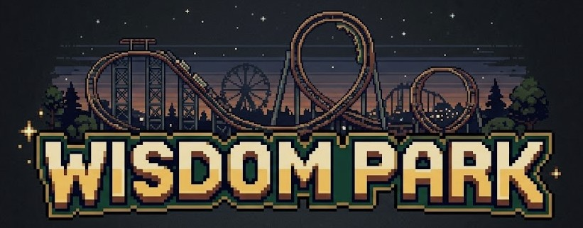
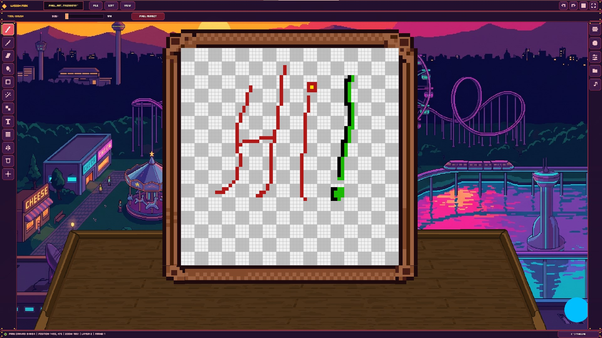

<p align="center">
  
</p>

<p align="center">
  
</p>

<p align="center">
  <a href="https://github.com/ahmad1827/WisdomPark/releases/latest">
    
  </a>
  <a href="https://github.com/ahmad1827/WisdomPark/releases">
    
  </a>
  
  
  
</p>

> [!WARNING]
> ### ⚠️ Pre-Release & AI Work-in-Progress Notice (`v0.x.x`)
> Wisdom Park is currently in active **alpha development**. While core canvas rendering, timeline animation, and export tools are functional, **all AI-assisted subroutines, generative workflows, and experimental features are actively in progress and may not function predictably**. Expect frequent breaking changes and updates between builds.

---

**Wisdom Park** is a high-performance, custom-built 2D animation and pixel art studio written in C++17 and powered by SFML 2.6.x. Designed for creative and game asset workflows, it bridges the gap between traditional frame-by-frame animation, retro pixel-perfect art, procedural texture generation, and modern AI-assisted creation.

---

## Core Features

### Canvas & Drawing Engine
* **Dynamic Canvas Resolutions:** Create projects ranging from 16x16 pixel art sprites to 4K HD illustrations, backed by optimized render texture allocations for fluid frame rates.
* **Dual Rendering Modes:**
  * *Normal Mode:* Smooth, anti-aliased brush strokes with customizable preset engine logic.
  * *Pixel Art Mode:* Hard-edged rendering with zero blurring, 1:1 grid snapping, configurable grid overlays, and visual tile-wrapping support for seamless repeating textures.
* **Pixel Perfect Engine:** Real-time stroke cleanup algorithm that eliminates double-thick diagonals and L-shaped corner artifacts during rapid brush strokes.
* **Advanced Selection System:** Freehand lasso selection supporting dragging, horizontal/vertical flipping, duplicating, cropping, erasing, and scaling via interactive transform handles.
* **Flood Fill:** Queue-based contiguous or global color replacement with adjustable tolerance math.

### Symmetry & Dithering Tools
* **Symmetry Manager:** Real-time symmetry drawing supporting vertical, horizontal, dual-axis, and multi-segment radial guides (2–32 segments) with an adjustable center axis.
* **Dithering Engine:** Built-in ordered dither algorithms (including Bayer 2x2, 4x4, 8x8, and checkerboard patterns) with adjustable density for classic retro shading.

### Animation & Timeline
* **Frame-by-Frame Timeline:** Add, duplicate, delete, and reorder frames with real-time playback and adjustable FPS.
* **Advanced Onion Skinning:** Simultaneous view of previous and next frames with independent frame count limits, fade curves, and opacity blending.
* **Audio Sync Engine:** Dedicated audio panel to scan local directories, load soundtracks, and sync playback with exact animation frame timing.

### Layer Architecture
* **Infinite Layers:** Full stack control with add, duplicate, delete, reorder, merge down, and merge visible operations.
* **Layer Properties:** Per-layer visibility, locking, color tags, opacity sliders, and blend modes (*Normal, Multiply, Additive, Screen, Overlay*).
* **Persistent Layers:** Designate static layers (such as backgrounds) to persist across all timeline frames without redundant memory allocation.
* **Reference & Asset Import:** Directly import PNG/JPG/BMP/WebP images into active layers with automatic proportion scaling and placement selection.

### AI & Generative Workflows *(Experimental)*
* **Async AI Generation:** Highlight region selections and invoke local or cloud-based generative AI tasks asynchronously without blocking the UI rendering loop.
* **Context-Aware Themes:** Prompt parameters customized for structural design, environmental clutter, custom rulesets, or Wave Function Collapse (WFC).
* **Interactive AI Review Modal:** Compare side-by-side visual diffs before choosing to accept (replace or add as new layer) or reject AI outputs.

### Hardware Input & Motion Controls
* **Hand Tracking Camera Listener:** Non-blocking UDP socket integration (Port 5005) listening for real-time normalized coordinate streams from external OpenCV/Python motion tracking modules.
* **Gesture Navigation:** Translate hand pinch gestures into real-time cursor movement, left/right clicks, and canvas zooming.

### Workspace & Viewport Dynamics
* **Intuitive Zoom-to-Cursor:** Natural viewport scaling anchored precisely under the active mouse pointer.
* **Flexible Display Modes:** Seamless toggle between Windowed, Fullscreen, and Borderless Windowed modes.
* **Collapsible UI Panels:** Animated left toolbar, right properties, color palettes, and layer inspectors with individual panel pinning.

### Project Management (`.wpk`) & Atlases
* **Custom Project Package:** Saves studio files in the `.wpk` format containing structured JSON metadata, timeline parameters, and uncompressed layer PNG channels.
* **Project Browser:** Visual main menu with real-time thumbnail previews, metadata statistics, and native OS file dialog support.
* **Sprite Sheet Studio:** Built-in export pipeline to pack animation frames into custom tileable sprite sheets or individual PNG slices accompanied by structural `-ATLAS.json` metadata.

---

## Tech Stack & Architecture

* **Language Standard:** C++17
* **Graphics & Viewport:** SFML 2.6.x (Simple and Fast Multimedia Library)
* **Data Serialization:** `nlohmann::json`
* **Network Protocol:** SFML Network (UDP Sockets for hand-tracking events)
* **UI Framework:** Modular Custom GUI Architecture (`CanvasTool`, `LeftToolbar`, `LayerPanel`, `PalettePanel`, `KeybindManager`)

---

## Building and Compiling

### Windows (MSVC / Visual Studio)

1. Generate the solution using CMake:
   ```cmd
   mkdir build
   cd build
   cmake -G "Visual Studio 17 2022" ..
   ```
2. Open and build `WisdomPark.sln` in `Release` configuration.
3. Ensure the required SFML DLLs (`sfml-graphics-2.dll`, `sfml-window-2.dll`, `sfml-system-2.dll`, `sfml-network-2.dll`, `sfml-audio-2.dll`) and `Resources/` directory are adjacent to `WisdomPark.exe`.

### Linux / WSL2

Ensure you have a C++17 compiler, CMake, and SFML 2.6 development libraries installed:

```bash
sudo apt update
sudo apt install build-essential cmake libsfml-dev

cd WisdomPark

mkdir build
cd build
cmake ..
make -j$(nproc)

./WisdomPark
```

---

## Default Shortcuts & Controls

All keybinds are fully reconfigurable via the built-in **Keybind Manager** (`ESC` in workspace or via Settings).

| Action | Shortcut |
| :--- | :--- |
| **Brush Tool** | `B` |
| **Pencil Tool** | `P` |
| **Eraser Tool** | `E` |
| **Fill Bucket** | `F` |
| **Lasso Select** | `M` |
| **Play / Pause Timeline** | `Space` |
| **Previous / Next Frame** | `Left Arrow` / `Right Arrow` |
| **Undo / Redo** | `Ctrl + Z` / `Ctrl + Y` |
| **Save Project** | `Ctrl + S` |
| **Export PNG / Sheet** | `Ctrl + E` |
| **Pan Canvas** | `Middle Mouse` or `Right Mouse Drag` |
| **Zoom Canvas** | `Mouse Wheel` |
| **Embedded Studio Debug** | `F8` |

---

## Credits & License

* **Lead Developer & Architect:** Ahmad Arnaoute (AtodDev)
* **Education:** Universitatea Politehnica București, Facultatea de Automatică și Calculatoare
* **License:** Commercial